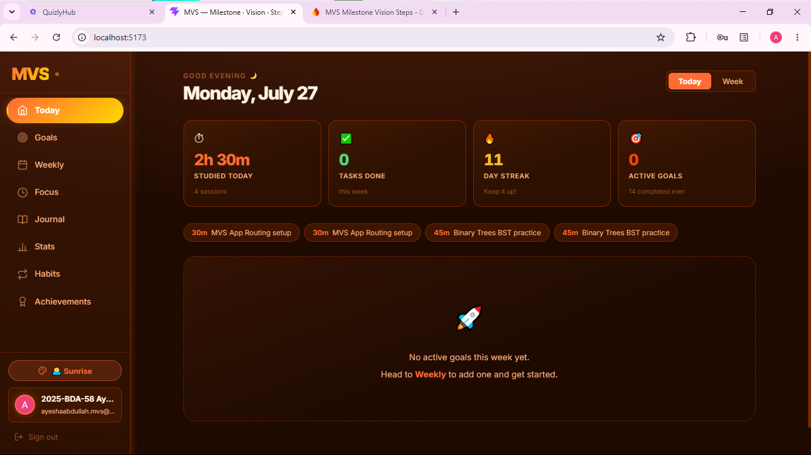
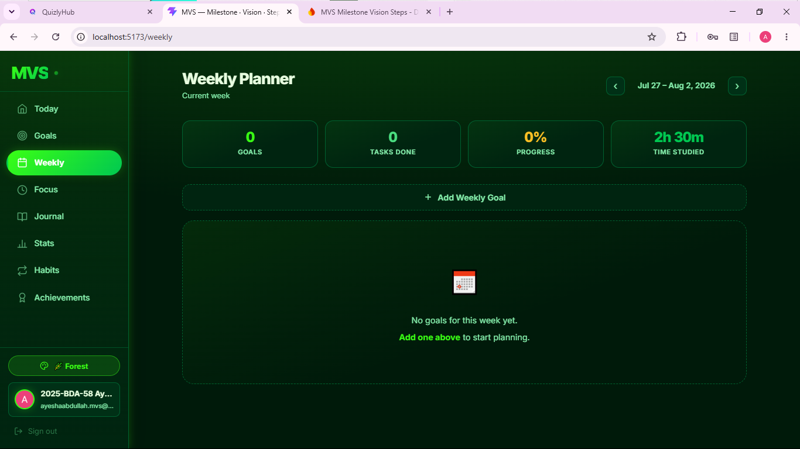
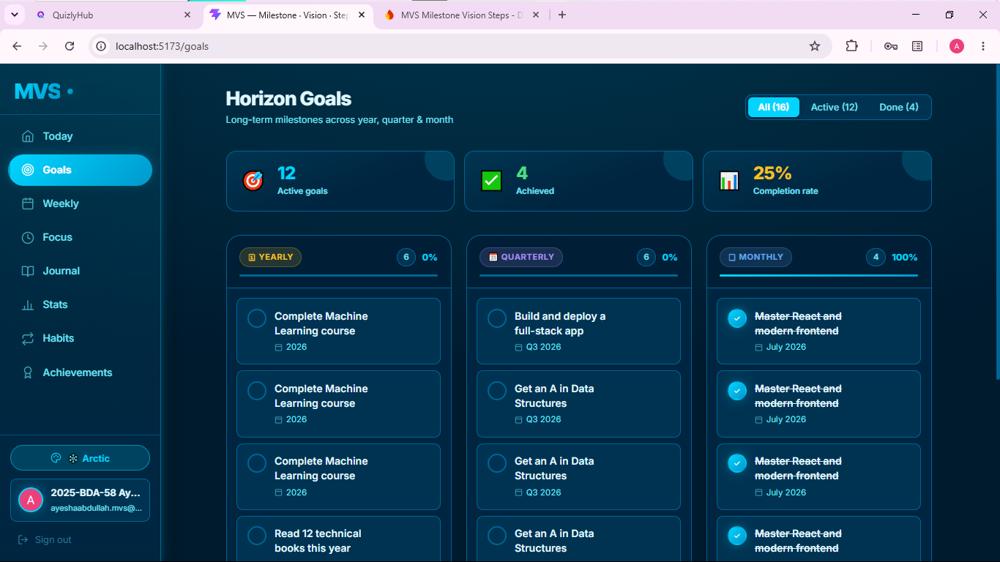
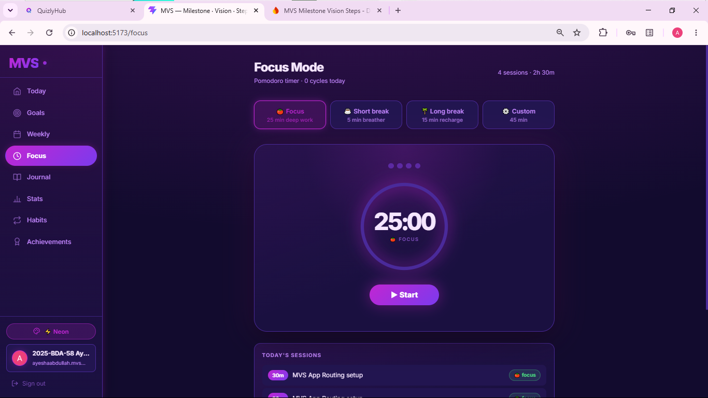
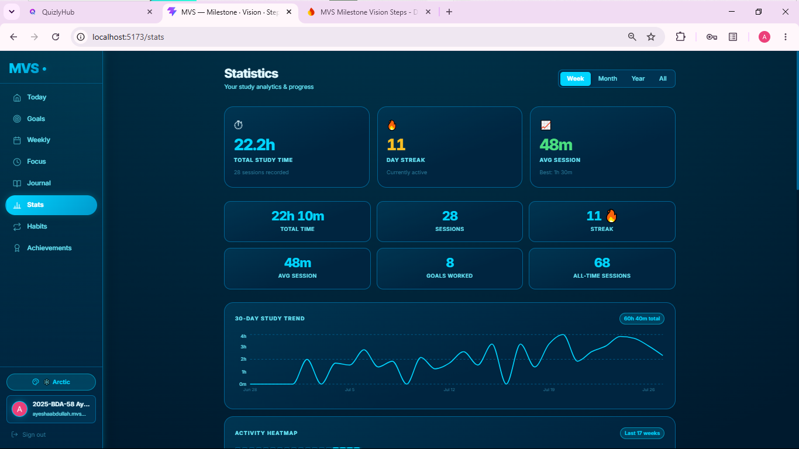
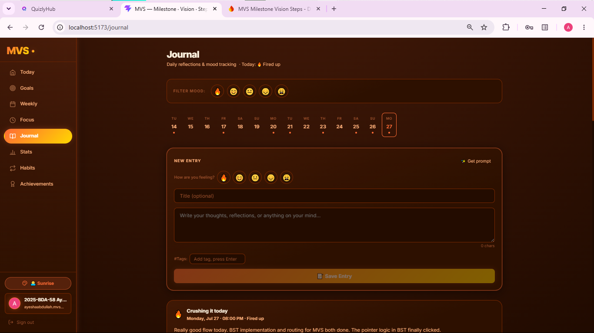
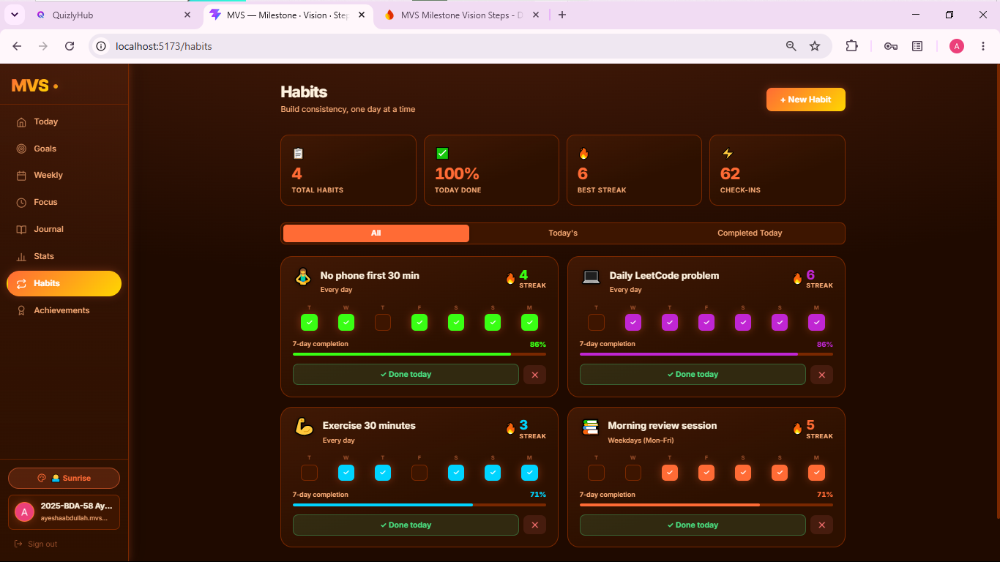
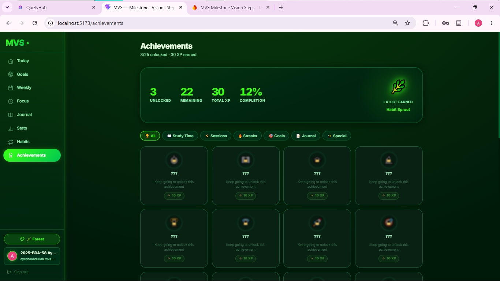
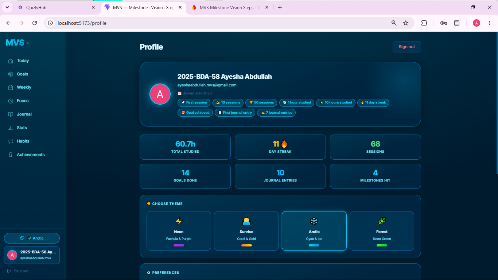

# MVS — Milestone · Vision · Steps

### An AI-powered personal study planner and goal tracker

**🌐 Live App:** [https://mvs-app-nine.vercel.app](https://mvs-app-nine.vercel.app)  
**📁 GitHub:** [https://github.com/ayeshaabdullah-analytics/mvs-app](https://github.com/ayeshaabdullah-analytics/mvs-app)

---

## The Problem This Solves

Most students have goals but no system connecting them to daily action. They set a big goal ("pass Data Structures"), forget about it by Wednesday, and only panic before exams. Existing tools are either too simple (a to-do list) or too complex (full project management software built for teams).

**MVS bridges that gap.** It gives students a structured three-layer planning system:

- **Milestone** — long-term horizon goals (year / quarter / month)
- **Vision** — weekly goals linked to those horizons
- **Steps** — AI-generated daily tasks that make the weekly goal achievable

The result is a complete study operating system: plan, focus, track, reflect — all in one place, with AI doing the heavy lifting of breaking big goals into daily steps.

---

## Live Demo

> 🚀 **[https://mvs-app-nine.vercel.app](https://mvs-app-nine.vercel.app)**

Open in an incognito window, sign up with a new account, and the app is immediately usable. No setup required.

---

## Screenshots

### Home Dashboard — Today's tasks, live stats, AI coach


### Weekly Planner — Goals linked to horizons, AI task breakdown


### Goals — 3-column Kanban board (Year / Quarter / Month)


### Focus Mode — Pomodoro timer with cycle tracker


### Statistics — Charts, heatmap, session history


### Journal — Daily reflections with mood tracking


### Habits — 7-day completion grid with streak counter


### Achievements — Dynamically unlocked badge wall


### Profile — Theme switcher, stats overview, settings


---

## What The App Does — Full Feature List

### Planning System
| Feature | Description |
|---|---|
| **Horizon Goals** | Set long-term goals at year, quarter, or month level. Organised in a 3-column Kanban board with progress bars and completion tracking. |
| **Weekly Goals** | Create weekly goals and link them to a horizon goal. Navigate between past and future weeks. |
| **AI Task Breakdown** | Enter a weekly goal, select which days you are available, and the AI generates a realistic daily task plan distributed across the week. |
| **Daily Task Management** | Tasks are displayed on the Today dashboard filtered to the current day. Mark tasks done directly from the home screen. |

### Focus & Productivity
| Feature | Description |
|---|---|
| **Pomodoro Timer** | Four modes: 25-minute focus, 5-minute short break, 15-minute long break, and a custom duration. |
| **Cycle Tracker** | Visual dots track how many focus cycles have been completed in the current session. |
| **Task-linked Sessions** | Pick a specific task to focus on before starting the timer. Finish and mark the task done in one click. |
| **Session Logging** | Every completed session is automatically saved to Firestore with start time, end time, duration, and linked goal. |

### Tracking & Analytics
| Feature | Description |
|---|---|
| **Statistics Page** | 30-day trend line chart, 17-week activity heatmap, time-by-day-of-week bar chart, time per goal breakdown, and a full session log. |
| **Streak Counter** | Calculates the current consecutive study day streak from session history. |
| **Habit Tracker** | Create habits with emoji, colour, and frequency settings. A 7-day completion grid shows consistency at a glance. Streak counter per habit. |
| **Achievements** | 25 badges across 6 categories (study time, sessions, streaks, goals, journal, special) that unlock automatically based on real usage data. |

### Reflection
| Feature | Description |
|---|---|
| **Daily Journal** | Write reflections with a mood rating (1–5), optional title, and tags. Entries are filterable by mood and date. |
| **14-day Calendar Strip** | Visual indicator showing which days have journal entries. |
| **AI Writing Prompts** | One-click random prompt to help start a reflection when unsure what to write. |
| **Mood Tracking** | Every entry stores a mood value. Filter entries by mood to review patterns over time. |

### Personalisation & Auth
| Feature | Description |
|---|---|
| **4 Vivid Themes** | Neon (purple), Sunrise (coral/gold), Arctic (cyan), Forest (neon green). Theme is saved per user in Firestore. |
| **Google OAuth + Email Auth** | Sign in with Google or email/password. |
| **Profile Page** | Shows all-time stats, unlocked achievement badges, theme picker, and account settings. |
| **Responsive Design** | Left sidebar on desktop collapses to icon-only on medium screens. Bottom tab bar on mobile. |

---

## The AI Feature

### What it does
MVS uses AI in two places:

**1. Weekly Goal → Daily Task Breakdown**  
The user types a weekly goal (e.g. *"Master binary trees and graph algorithms"*) and selects which days of the week they are available. The AI returns a structured JSON plan assigning specific tasks to specific days, which the user can edit before saving.

**2. AI Coach Insight**  
On the Today page, each goal block has a "✦ AI Coach insight" button. The AI receives the goal title and current completion stats, then writes a short personalised motivational message.

### The exact system prompts used

**Goal Breakdown prompt:**
```
System: You are a flexible study planning assistant. A student will give
you a weekly goal and the days they have available. Break the goal into
smaller tasks distributed across those days. Do NOT assign any clock
times — only assign which day of the week each task belongs to, or leave
a task unassigned to a specific day if it's better done whenever the
student has time. Output ONLY valid JSON:
[{"day": "Monday" or null, "task": "short description"}].
Keep each task under 10 words. Distribute realistically — not every day
needs a task.

User: Weekly goal: "[goal title]"
      Available days: Monday, Wednesday, Friday
```

**Coach Insight prompt:**
```
You are an encouraging study coach. A student's weekly goal is:
"[goal title]". They have X of Y tasks completed. Write a short 2-3
sentence motivational insight. Never mention clock times, never
guilt-trip about gaps. Be warm and specific to their progress.
```

### AI model and provider
- **Provider:** [Groq](https://console.groq.com) — free API, extremely fast inference
- **Model:** `llama-3.3-70b-versatile` (Meta's Llama 3.3, 70 billion parameters)
- **Why Groq:** Near-instant responses (under 1 second), free tier, OpenAI-compatible API

---

## Tech Stack

| Layer | Technology |
|---|---|
| **Frontend framework** | React 19 with functional components and hooks |
| **Routing** | React Router v7 |
| **Build tool** | Vite 8 |
| **Charts** | Recharts (bar chart, line chart) |
| **Authentication** | Firebase Authentication — Email/Password + Google OAuth |
| **Database** | Cloud Firestore — real-time listeners via `onSnapshot` |
| **AI** | Groq API with Llama 3.3-70b-versatile |
| **Deployment** | Vercel (auto-deploy from GitHub) |
| **Linting** | oxlint |

---

## Firestore Data Model

All collections are user-scoped — every document has a `userId` field matching `auth.currentUser.uid`.

```
horizonGoals/        Year, quarter, month long-term goals
weeklyGoals/         Weekly goals linked to horizon goals
dailyTasks/          Tasks linked to weekly goals, with day assignment
sessions/            Timer sessions with start, end, duration, linked goal
journalEntries/      Daily journal entries with mood, tags, body text
habits/              Habit definitions (name, emoji, frequency, color)
habitCheckins/       Per-day habit completion records
userSettings/        Theme preference per user
```

---

## How to Run Locally

### Prerequisites
- Node.js 18 or higher
- A Firebase project with **Authentication** and **Firestore** enabled
- A Groq API key — free at [console.groq.com](https://console.groq.com)

### Steps

```bash
# 1. Clone the repository
git clone https://github.com/ayeshaabdullah-analytics/mvs-app.git
cd mvs-app

# 2. Install dependencies
npm install

# 3. Create environment file
cp .env.example .env
```

Edit `.env` and fill in your real values:

```env
VITE_FIREBASE_API_KEY=your_firebase_api_key
VITE_FIREBASE_AUTH_DOMAIN=your_project.firebaseapp.com
VITE_FIREBASE_PROJECT_ID=your_project_id
VITE_FIREBASE_STORAGE_BUCKET=your_project.appspot.com
VITE_FIREBASE_MESSAGING_SENDER_ID=your_sender_id
VITE_FIREBASE_APP_ID=your_app_id
VITE_GROQ_API_KEY=your_groq_key
```

```bash
# 4. Start the development server
npm run dev
```

Open [http://localhost:5173](http://localhost:5173)

```bash
# 5. Build for production
npm run build
```

### Firebase setup required
1. Go to [console.firebase.google.com](https://console.firebase.google.com)
2. Create a project → enable **Firestore Database** (start in test mode)
3. Enable **Authentication** → turn on Email/Password and Google providers
4. Copy your web app config into `.env`
5. In Firestore **Rules**, publish this so only logged-in users can access data:

```
rules_version = '2';
service cloud.firestore {
  match /databases/{database}/documents {
    match /{document=**} {
      allow read, write: if request.auth != null;
    }
  }
}
```

6. In Authentication → **Settings → Authorized domains**, add your deployed domain (e.g. `mvs-app-nine.vercel.app`)

---

## Deploying to Vercel

1. Push to a public GitHub repository
2. Go to [vercel.com](https://vercel.com) → **Add New Project** → import the repo
3. In **Settings → Environment Variables**, add all 7 variables from `.env`
4. Click **Deploy** — Vercel auto-detects Vite, no configuration needed
5. Add the deployed domain to Firebase's authorized domains list

---

## Project Structure

```
mvs-app/
├── public/                  Static assets
├── screenshots/             App screenshots for this README
├── src/
│   ├── components/
│   │   ├── Navbar.jsx       Left sidebar + mobile tab bar
│   │   ├── Timer.jsx        Study timer modal component
│   │   └── ProtectedRoute.jsx
│   ├── context/
│   │   ├── AuthContext.jsx  Firebase auth state management
│   │   └── ThemeContext.jsx 4-theme system, persisted to Firestore
│   ├── hooks/
│   │   └── useFirestore.js  useCollection, useAdd, useUpdate, useDelete
│   ├── pages/
│   │   ├── Home.jsx         Today dashboard
│   │   ├── Goals.jsx        Horizon goals Kanban
│   │   ├── Weekly.jsx       Weekly planner + AI breakdown
│   │   ├── Focus.jsx        Pomodoro timer
│   │   ├── Journal.jsx      Daily journal + mood tracker
│   │   ├── Stats.jsx        Analytics and charts
│   │   ├── Habits.jsx       Habit tracker
│   │   ├── Achievements.jsx Badge wall
│   │   └── Profile.jsx      Settings and theme picker
│   ├── services/
│   │   ├── groq.js          Groq / Llama 3.3 integration
│   │   └── gemini.js        Gemini integration (alternate)
│   ├── styles/              Per-page CSS files
│   └── utils/
│       └── dates.js         Date helpers (streaks, week maths, formatting)
├── .env.example             Environment variable template
├── .gitignore               Excludes .env and node_modules
├── index.html
├── package.json
└── vite.config.js
```

---

## Environment Variables Reference

| Variable | Where to get it |
|---|---|
| `VITE_FIREBASE_API_KEY` | Firebase Console → Project Settings → Your apps |
| `VITE_FIREBASE_AUTH_DOMAIN` | Same |
| `VITE_FIREBASE_PROJECT_ID` | Same |
| `VITE_FIREBASE_STORAGE_BUCKET` | Same |
| `VITE_FIREBASE_MESSAGING_SENDER_ID` | Same |
| `VITE_FIREBASE_APP_ID` | Same |
| `VITE_GROQ_API_KEY` | [console.groq.com](https://console.groq.com) → API Keys |

> ⚠️ Never commit `.env` to GitHub. It is listed in `.gitignore` and all real values are stored only in Vercel's environment variable settings.
